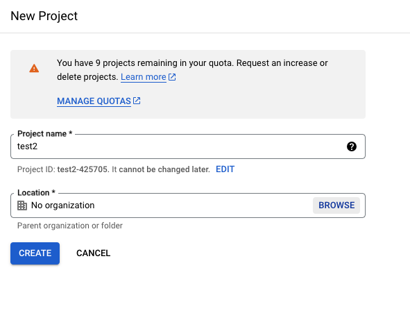
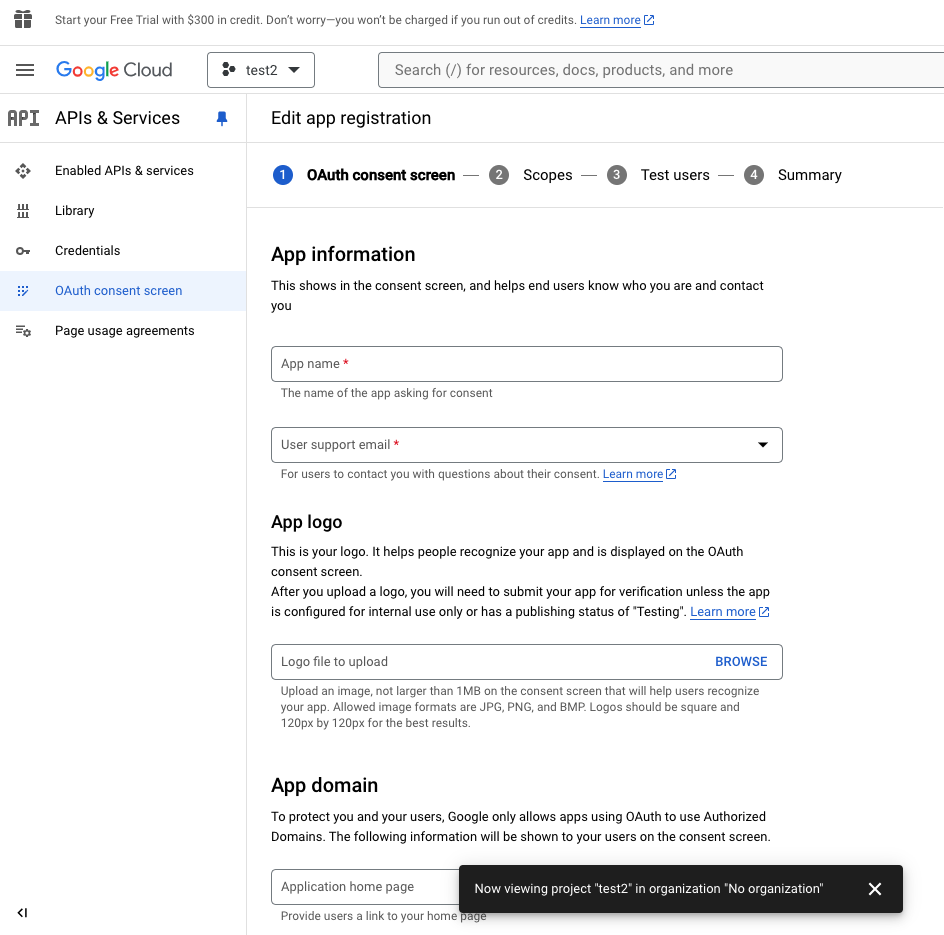
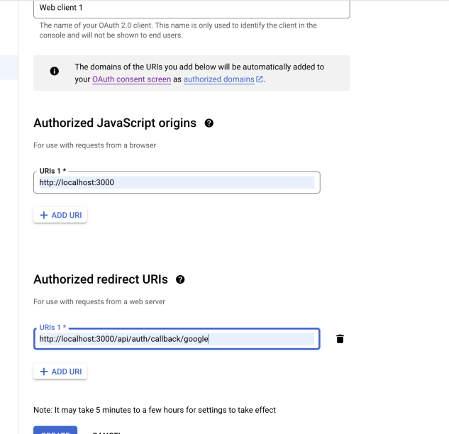

<div align="center">
  <h1 style="font-size: 36px; font-weight: bold;">ShareHub</h1>


</div>

## FOLLOW THESE STEPS TO SET LOCALLY

1. Fork the repository (Click the Fork button in the top right on Github)
2. Clone the forked repository to your local machine.

```markdown
git clone https://github.com/punyakrit/social-share.git
```

_Run the command to install npm package_

```markdown
npm install
```

### STEPS TO CONNECT WITH THE MONGODB

```bash
cp .env.example .env
```

```bash
Update all these env variables
GOOGLE_CLIENT_ID
GOOGLE_CLIENT_SECRET
NEXTAUTH_URL
NEXTAUTH_SECRET
MONGODB_URI
BUCKET
S3_ACCESS_KEY
S3_SECRET_ACCESS_KEY
```

### Steps to create your own google credentials

```bash
https://console.cloud.google.com/
```

### Create a new project and name it




### Select the project


### By click external, Add email and project name click on next


### Add data as same as in the given image


Save and Copy the GOOGLE_CLIENT_ID, GOOGLE_CLIENT_SECRET

## Add these data as same as it is given inside .env file

### NEXTAUTH_URL

```bash
 http://localhost:3000
```

### NEXTAUTH_SECRET

```bash
test

```

### Commands to run the development server:

```markdown
# Using npm

npm run dev
```

```

Open [http://localhost:3000](http://localhost:3000) with your browser to see the result.

You can start editing the page by modifying `app/page.tsx`. The page auto-updates as you edit the file.

```

<!-- Open Source Programs -->
<div>
    <h2> Open Source Programs </h2>
</div>

This project is a part of GirlScript Summer of code. We welcome contibutions from the community to help improve the project social-share.


<!-- Acknowledgement -->
<div>
<h2> Acknowledgement </h2>

We would like to express our gratitude to the following contributors for their valuable contributions to Social Share

<!-- Cotributors -->
<div>
  <h2> Contributors</h2>
</div>

<a href="https://github.com/punyakrit/social-share/graphs/contributors">
  
</a>

<br/>
<p align="center">
	Developed with ❤️ by The <a href="https://github.com/punyakrit/social-share"><strong>Social Share Team</strong></a>
</p>

<p align="right">(<a href="#top">Back to top</a>)</p>
